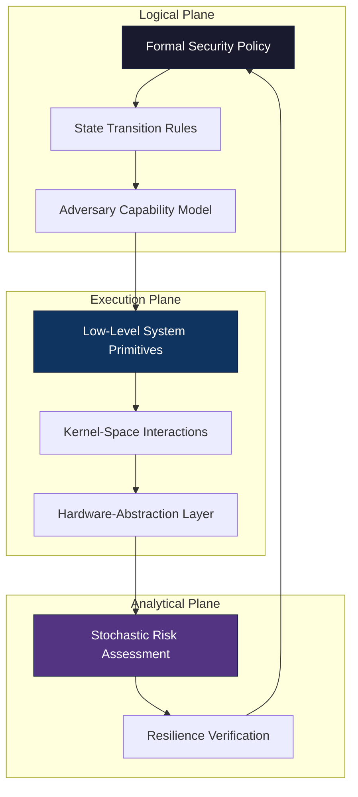

# Critical Infrastructure Resilience & Advanced System Modeling

## 🏛️ Strategic Technical Manifest

This repository serves as a **Formalized Adversary Emulation Environment** for the study of critical infrastructure resilience. It utilizes a multi-dimensional approach combining **Symbolic Logic**, **Discrete Mathematics**, and **Low-Level System Engineering** to model complex security states and defensive posture efficacy.

---

### 🌐 System Architecture & State Transition Logic

The framework is architected as a non-deterministic state machine where network nodes and system primitives interact within a predefined logical boundary.

---

### 🔬 Scientific Foundations

#### 1. Formal Verification & Symbolic Logic

The environment leverages **Predicate Logic** to define reachability within isolated network segments. Security boundaries are treated as formal constraints, allowing for the mathematical verification of "leakage paths" between critical and non-critical assets.

#### 2. Algebraic Cryptographic Analysis

Rather than focusing on specific implementation flaws, the framework models **Algebraic Attack Primitives**. This includes:

- **Side-Channel Information Entropy**: Modeling data leakage through unintended physical or timing emissions.
- **Lattice-Based Complexity**: Analyzing the hardness of mathematical problems underpinning modern asymmetric primitives.
- **Protocol Logic Invariants**: Focused on the formal consistency of protocols rather than transient software artifacts.

#### 3. High-Precision Systems Programming

The "Elite" execution tier focuses on **Non-Standard System Interactions**:

- **Kernel-Level Persistence Logic**: Modeling of stealth mechanisms within Ring 0 environments.
- **Fileless Execution Pipelines**: Utilizing in-memory volatility primitives to simulate high-sophistication persistence.
- **Binary Polymorphism**: Formal modeling of self-mutating code logic for evasion research.

---

### 📜 International Standards & Quality Frameworks

The methodology integrated into this framework aligns with global standards for critical infrastructure security and technical excellence:

| Standard | Application Area | Methodology |
| :--- | :--- | :--- |
| **ISO/IEC 27001** | Information Security Management | Risk-based state controls and formal audit trails. |
| **IEC 62443** | Industrial Automation & Control | Defense-in-depth modeling for OT/ICS environments. |
| **NIST SP 800-115** | Technical Security Assessment | Systematic approach to technical security testing. |
| **MITRE ATT&CK®** | Adversary Behavior Modeling | Mapping high-level tactics to discrete system primitives. |

---

### ⚠️ SAFETY & SIMULATION NOTICE

This repository is a **PURELY THEORETICAL MODEL** used for high-level simulation.

> [!IMPORTANT]
> **Total Semantic Abstraction**: All identifiers (e.g., `OPD-CGI`, `INFRA-SYSARCH`) are internal symbolic tokens. They do not correlate with any physical entity.
> 
> **Scope**: This is a laboratory environment for **Computational Resilience Engineering**.
> 
> **Compliance**: All research conducted within this framework is intended for the advancement of defensive sciences and the hardening of global critical infrastructure.

---

### 💎 Engineering Excellence | Mathematical Rigor | System Integrity
