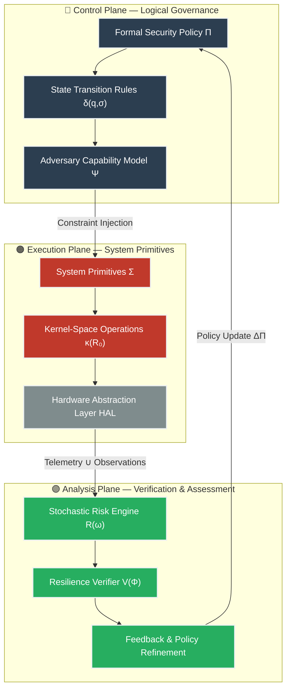
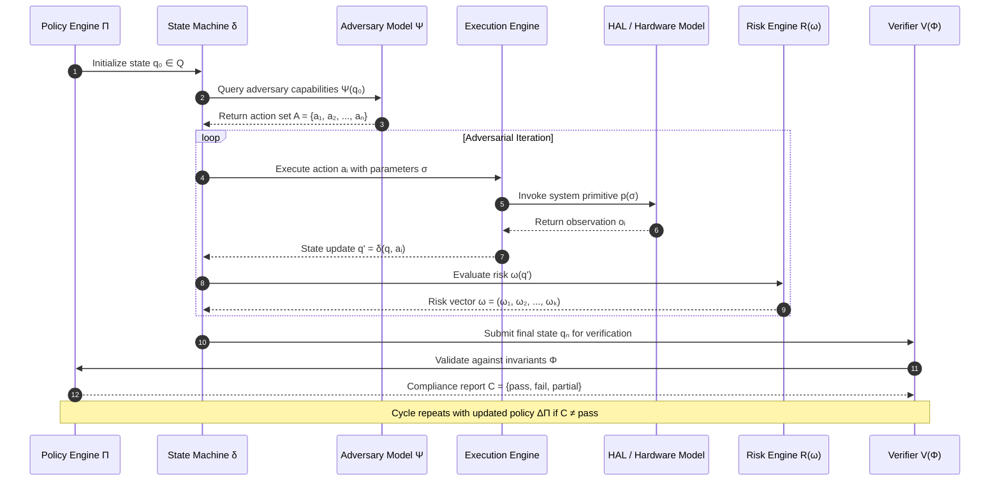
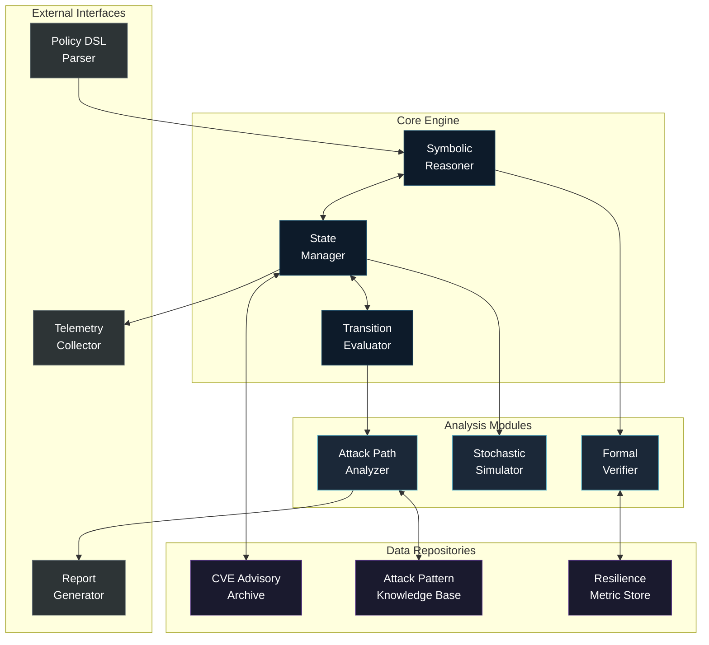
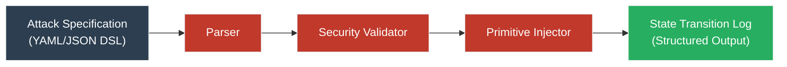
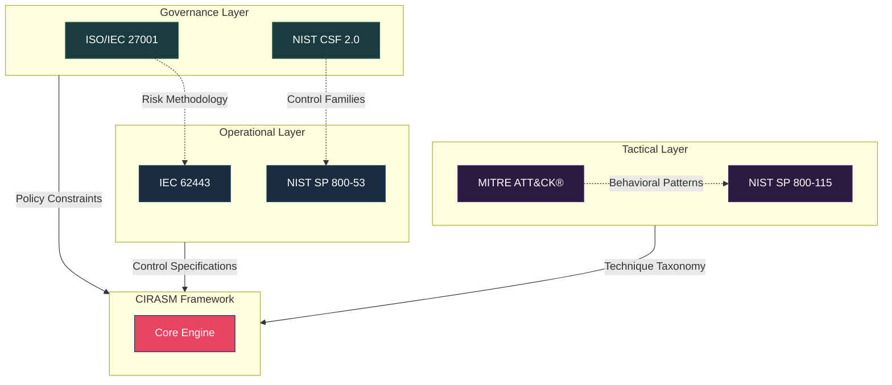
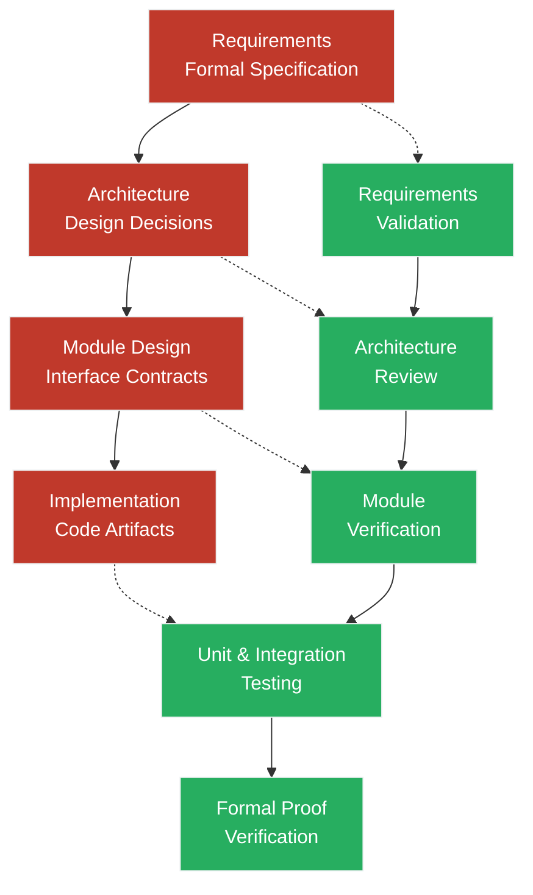

# Critical Infrastructure Resilience & Advanced System Modeling

> **Formalized Adversary Emulation Environment** — A mathematically-grounded framework for modeling, analyzing, and verifying the resilience posture of critical infrastructure systems through symbolic logic, discrete mathematics, and low-level systems engineering.

---

<div align="center">

[](https://github.com)
[](https://www.iso.org/standard/27001)
[](https://www.isa.org/standards)
[](LICENSE)
[](https://semver.org/)
[](https://attack.mitre.org)

**Formalized Adversary Emulation & Resilience Verification for Critical Systems**

*High-Fidelity Simulation • Symbolic Logic • Reverse Security Engineering*

</div>

---

## Table of Contents

- [1. Executive Summary](#1-executive-summary)
- [2. System Architecture](#2-system-architecture)
- [3. Scientific Foundations](#3-scientific-foundations)
- [4. Execution Model & Primitives](#4-execution-model--primitives)
- [5. Threat Modeling Methodology](#5-threat-modeling-methodology)
- [6. International Standards & Compliance](#6-international-standards--compliance)
- [7. Project Structure](#7-project-structure)
- [8. Quality Assurance & Verification](#8-quality-assurance--verification)
- [9. Safety, Ethics & Simulation Boundaries](#9-safety-ethics--simulation-boundaries)
- [10. Contributing & Governance](#10-contributing--governance)
- [11. References](#11-references)
- [12. License](#12-license)

---

## 1. Executive Summary

### 1.1 Purpose

This repository constitutes a **Formalized Adversary Emulation Environment** designed for the computational study of critical infrastructure resilience. Unlike traditional penetration testing frameworks, this system employs a deterministic approach grounded in **Symbolic Logic** and **Discrete Mathematics** to model security states, eliminating ambiguity in defensive posture evaluation.

### 1.2 Key Objectives

| # | Objective | Description |
|:-:|:----------|:------------|
| 1 | **Formal Verification** | Mathematical modeling of security boundaries and detection of illegitimate access paths between asset classifications |
| 2 | **Advanced Threat Emulation** | Simulation of state-level adversary behavior through low-level system primitives within a sandboxed environment |
| 3 | **Resilience Engineering** | Stochastic quantification of risk, degradation curves, and mean-time-to-recovery under systemic compromise |
| 4 | **Standards Alignment** | Full traceability to ISO/IEC 27001, IEC 62443, NIST CSF 2.0, and MITRE ATT&CK® |

### 1.3 Design Axes

```
┌──────────────────────────────────────────────────────────────────┐
│                        DESIGN AXES                               │
├──────────────────┬────────────────────┬──────────────────────────┤
│  MATHEMATICAL    │   ENGINEERING      │   OPERATIONAL            │
│  RIGOR           │   PRECISION        │   RELEVANCE              │
├──────────────────┼────────────────────┼──────────────────────────┤
│ Predicate Logic  │ Ring-0 Primitives  │ ISO/IEC 27001            │
│ Lattice Theory   │ Binary Analysis    │ IEC 62443                │
│ Graph Theory     │ Memory Forensics   │ NIST CSF 2.0             │
│ Stochastic Calc  │ Protocol Design    │ MITRE ATT&CK®            │
└──────────────────┴────────────────────┴──────────────────────────┘
```

### 1.4 Scope Boundaries

| Dimension | In Scope | Out of Scope |
|-----------|----------|--------------|
| **Domain** | Computational resilience modeling, formal verification, adversary emulation theory | Operational exploitation, offensive tooling deployment |
| **Abstraction** | Symbolic representations, mathematical models, simulated environments | Real-world target systems, production infrastructure |
| **Audience** | Security researchers, academic institutions, infrastructure engineers | Untrained operators, unauthorized third parties |
| **Output** | Formal proofs, risk models, resilience metrics, defensive strategies | Weaponized artifacts, functional exploit code |

---

## 2. System Architecture

The system is designed as a **Non-Deterministic Finite State Machine (NFSM)**, decoupled across three orthogonal planes to ensure separation of concerns and mathematical model purity.

### 2.1 Top-Level Architecture



### 2.2 Layered Decomposition

```mermaid
graph LR
    classDef l7 fill:#c0392b,stroke:#ecf0f1,color:#fff;
    classDef l6 fill:#d35400,stroke:#ecf0f1,color:#fff;
    classDef l5 fill:#e67e22,stroke:#ecf0f1,color:#fff;
    classDef l4 fill:#f39c12,stroke:#ecf0f1,color:#fff;
    classDef l3 fill:#27ae60,stroke:#ecf0f1,color:#fff;
    classDef l2 fill:#2980b9,stroke:#ecf0f1,color:#fff;
    classDef l1 fill:#8e44ad,stroke:#ecf0f1,color:#fff;

    L7["L7 — Policy Layer<br/>Security Invariants & Compliance"]:::l7
    L6["L6 — Orchestration<br/>State Machine Engine & Scenario Compiler"]:::l6
    L5["L5 — Modeling<br/>Adversary Graph & Attack Surface Mapper"]:::l5
    L4["L4 — Emulation<br/>Primitive Executor & Interaction Sequencer"]:::l4
    L3["L3 — Abstraction<br/>OS Interface & Network Interface"]:::l3
    L2["L2 — HAL<br/>Memory Controller & I/O Scheduler"]:::l2
    L1["L1 — Physical Model<br/>Hardware Simulation & Side-Channel Model"]:::l1

    L7 --> L6 --> L5 --> L4 --> L3 --> L2 --> L1
```



### 2.3 Data Flow & State Transitions



### 2.4 Component Interaction Model



---

## 3. Scientific Foundations

### 3.1 Formal Verification & Symbolic Logic

The framework employs **first-order predicate logic** to define security invariants across network segment boundaries. Security perimeters are modeled as formal constraints within a state space S, enabling mathematical proof of property preservation or violation.

**Core Formalism:**

```
Given:
  State space:         S = {s₀, s₁, ..., sₙ}
  Transition function: δ : S × Σ → S
  Security invariant:  Φ : S → {⊤, ⊥}
  Reachability:        Reach(sᵢ, sⱼ) ↔ ∃ path p ∈ δ* : sᵢ →* sⱼ

Property (Non-Interference):
  ∀ sᵢ ∈ S_critical, sⱼ ∈ S_noncritical :
    ¬Reach(sⱼ, sᵢ) ∨ Φ(sᵢ) = ⊤

Leakage Path:
  Leakage(sᵢ, sⱼ) ↔ Reach(sⱼ, sᵢ) ∧ Φ(sᵢ) = ⊥
```

> **Invariant Example:**
> ∀s ∈ States, ∀a ∈ Actions: (Secure(s) ∧ Execute(a, s) → Secure(s')) ⇔ Resilient(s)

### 3.2 Algebraic Cryptographic Analysis

Rather than targeting specific implementation vulnerabilities, the framework models **algebraic attack primitives** at the mathematical structure level:

| Analysis Domain | Formal Object | Application |
|:----------------|:--------------|:------------|
| **Side-Channel Entropy** | H(X\|Y) — Conditional entropy of observable Y given secret X | Quantify information leakage through timing, power, or electromagnetic emissions |
| **Lattice Complexity** | GapSVP, SIVP — Shortest vector problem approximations | Evaluate post-quantum hardness assumptions (NTRU, Kyber, Dilithium) |
| **Protocol Invariants** | Strand spaces, authentication tests | Verify logical consistency of key exchange and authentication protocols |
| **Compositional Security** | Universal composability (UC) framework | Prove security properties preserved under arbitrary composition |

### 3.3 High-Precision Systems Programming

The "Elite" execution tier models **non-standard system interactions** that characterize advanced persistent threat behavior:

| Technique | Technical Description | Model Impact |
|:----------|:----------------------|:-------------|
| **Ring-0 Persistence** | Injection of logic into non-paged kernel regions | Evasion of standard forensic tools |
| **Fileless Execution** | In-memory volatile execution pipelines (RAM-only) | Imperceptible to disk-based scans |
| **Binary Polymorphism** | Runtime logical code mutation | Invalidation of static signatures (hash-based) |


> **Note**: All mechanisms above are **symbolic models** — abstract representations for formal analysis. No functional exploit code is contained within this repository.

### 3.4 Stochastic Resilience Modeling

Resilience is quantified through a probabilistic framework:

```
Resilience Metric:
  R(t) = ∫₀ᵗ Q(τ) dτ / t

  Where Q(τ) = Quality of service at time τ ∈ [0, 1]
  Q(τ) = 1      → Full operational capacity
  Q(τ) = 0      → Complete service failure
  Q(τ) ∈ (0,1)  → Degraded operation

Recovery Function:
  ρ(t) = Q(t) / Q(0) × 100%

Mean Time to Recovery:
  MTTR = E[T_recovery] = ∫₀^∞ t · f_recovery(t) dt
```

---

## 4. Execution Model & Primitives

All operations are encapsulated within a **Hyper-Supervised Sandbox**. The execution engine does not execute binaries directly — it interprets a Domain-Specific Language (DSL) that translates logical actions into simulated or encapsulated system calls.

### 4.1 Execution Pipeline



### 4.2 DSL Example

<details>
<summary><strong>Click to expand — Execution Engine Specification</strong></summary>

```json
{
  "action": "kernel_persistence_test",
  "target_module": "syscall_table_hook",
  "constraints": {
    "timeout_ms": 500,
    "rollback_on_failure": true,
    "sandbox_level": "hyper-supervised"
  },
  "expected_outcome": {
    "state_transition": "s_i → s_j",
    "invariant_check": "Φ(s_j) = ⊤"
  }
}
```

**Pipeline:**
- **Input:** Attack specification in DSL (YAML/JSON)
- **Processing:** Parser → Security Validator → Primitive Injector
- **Output:** Structured state transition log with invariant verification

</details>

### 4.3 Framework Taxonomy

```mermaid
graph TD
    classDef root fill:#e94560,stroke:#0f3460,color:#fff;
    classDef branch fill:#0f3460,stroke:#16213e,color:#fff;
    classDef leaf fill:#1a1a2e,stroke:#533483,color:#fff;

    ROOT["CIRASM Framework"]:::root

    ROOT --> FV["Formal Verification"]:::branch
    ROOT --> CA["Cryptographic Analysis"]:::branch
    ROOT --> SP["Systems Programming"]:::branch
    ROOT --> SR["Stochastic Resilience"]:::branch
    ROOT --> TM["Threat Modeling"]:::branch

    FV --> FV1["Model Checking"]:::leaf
    FV --> FV2["Theorem Proving"]:::leaf
    FV --> FV3["Abstract Interpretation"]:::leaf

    CA --> CA1["Side-Channel Analysis"]:::leaf
    CA --> CA2["Lattice-Based Evaluation"]:::leaf
    CA --> CA3["Protocol Verification"]:::leaf

    SP --> SP1["Kernel Primitives"]:::leaf
    SP --> SP2["Memory Forensics Models"]:::leaf
    SP --> SP3["Binary Analysis"]:::leaf

    SR --> SR1["Monte Carlo Simulation"]:::leaf
    SR --> SR2["Markov Chain Models"]:::leaf
    SR --> SR3["Bayesian Inference"]:::leaf

    TM --> TM1["Attack Tree Generation"]:::leaf
    TM --> TM2["Kill Chain Mapping"]:::leaf
    TM --> TM3["MITRE ATT&CK® Alignment"]:::leaf
```



---

## 5. Threat Modeling Methodology

### 5.1 Kill Chain Decomposition


### 5.2 Attack Tree Formalism

```
Root Goal: Compromise Critical Infrastructure Asset [G₀]
│
├── [G₁] Gain Unauthorized Access
│   ├── [A₁.1] Exploit Network Perimeter
│   │   ├── [L₁] Firewall Rule Bypass
│   │   └── [L₂] VPN Credential Compromise
│   ├── [A₁.2] Exploit Application Layer
│   │   ├── [L₃] Web Application Vulnerability
│   │   └── [L₄] API Authentication Bypass
│   └── [A₁.3] Supply Chain Compromise
│       ├── [L₅] Dependency Poisoning
│       └── [L₆] Hardware Implant
│
├── [G₂] Establish Persistence
│   ├── [A₂.1] Kernel-Level Rootkit
│   ├── [A₂.2] Firmware Modification
│   └── [A₂.3] Scheduled Task Abuse
│
└── [G₃] Achieve Operational Objective
    ├── [A₃.1] Data Exfiltration
    ├── [A₃.2] Process Manipulation
    └── [A₃.3] Denial of Service

Cost Model:
  C(path) = Σᵢ c(aᵢ) × P(success | aᵢ)
  Risk(path) = Impact(G₀) × P(success(path))
```

---

## 6. International Standards & Compliance

### 6.1 Primary Standards Alignment

| Standard | Domain | Application in Framework | Compliance |
|:---------|:-------|:-------------------------|:-----------|
| **ISO/IEC 27001:2022** | Information Security Management | Risk-based state controls, formal audit trails, asset classification methodology | Design Reference |
| **IEC 62443** | Industrial Automation & Control Systems | Defense-in-depth modeling for OT/ICS environments, security level (SL) verification | Architectural Alignment |
| **NIST SP 800-115** | Technical Security Testing | Structured methodology for vulnerability identification and validation | Process Reference |
| **NIST SP 800-53 Rev. 5** | Security & Privacy Controls | Control family mapping for simulation scenarios | Control Taxonomy |
| **MITRE ATT&CK® v14** | Adversary Behavior | Tactic/technique mapping to discrete system primitives | Full Mapping |
| **NIST CSF 2.0** | Cyber Risk Management | Identify, Protect, Detect, Respond, Recover function alignment | Functional Coverage |

### 6.2 Standards Interaction Model



### 6.3 Quality Attributes

| Quality Attribute | Requirement | Verification Method |
|:------------------|:------------|:-------------------|
| **Correctness** | All formal proofs must be mechanically verifiable | Theorem prover validation (Coq/Isabelle compatible) |
| **Reproducibility** | All simulation runs must produce identical results given identical inputs | Deterministic seeding + state serialization |
| **Traceability** | Every analysis output must trace to a formal specification element | Bidirectional requirement mapping |
| **Completeness** | State space coverage must meet defined coverage thresholds | Coverage analysis against state space cardinality |
| **Auditability** | All framework operations must generate immutable audit logs | Append-only event log with cryptographic integrity |

---

## 7. Project Structure

```
plan/
├── README.md                          # This document
├── manifest.json                      # Project manifest & risk summary
├── .gitignore                         # Build/editor/OS exclusions
│
├── ai-context/                        # Structured Context for AI Consumption
│   ├── project-summary.md             # High-level project overview
│   ├── exploitation-graph.md          # Attack path dependency graph
│   ├── attack-surface.json            # Machine-readable attack surface model
│   └── strategic-execution.md         # Strategic execution methodology
│
├── schemas/                           # JSON Schemas for Data Validation
│   ├── cve-advisory.schema.json       # CVE advisory document schema
│   ├── host-scan.schema.json          # Host scan result schema
│   └── port-scan.schema.json          # Port scan result schema
│
├── infrastructure/                    # Scanned Infrastructure Data
│   ├── zones/                         # Network zone definitions
│   │   ├── Z01-DMZ/                   # Demilitarized zone
│   │   ├── Z02-Internal-Servers/      # Internal server segment
│   │   ├── Z03-Internal-Workstations/ # Workstation segment
│   │   ├── Z04-Internal-WiFi/         # Wireless network segment
│   │   ├── Z05-Virtual/               # Virtualization segment
│   │   ├── Z06-External/              # External-facing segment
│   │   ├── Z07-Monitoring/            # Monitoring & SIEM segment
│   │   ├── Z08-Subred-4/              # Auxiliary subnet
│   │   ├── Z09-DMZ-OPD/               # Secondary DMZ
│   │   └── Z10-Docker/                # Container orchestration segment
│   └── ports/                         # Port scan data per host
│
├── vulnerabilities/                   # CVE Advisories & Technical Analysis
│   ├── CVE-2016-1240/                 # Tomcat privilege escalation
│   ├── CVE-2019-0211/                 # Apache privilege escalation
│   ├── CVE-2019-1547/                 # OpenSSL ECDSA timing attack
│   ├── CVE-2019-1559/                 # OpenSSL padding oracle
│   ├── CVE-2019-1563/                 # OpenSSL CMS decrypt leak
│   ├── CVE-2019-10081/                # Apache mod_http2 memory corruption
│   ├── CVE-2019-11043/                # PHP-FPM remote code execution
│   ├── CVE-2021-21703/                # PHP-FPM privilege escalation
│   └── CVE-2021-4034/                 # Polkit pkexec local privilege escalation
│
├── exploits/                          # Proof-of-Concept Exploitation Code
│   ├── cve/                           # CVE-specific exploit modules
│   │   ├── CVE-2016-1240/
│   │   ├── CVE-2019-0211/
│   │   ├── CVE-2019-1547/
│   │   ├── CVE-2019-1559/
│   │   ├── CVE-2019-1563/
│   │   ├── CVE-2019-10081/
│   │   ├── CVE-2019-11043/
│   │   ├── CVE-2021-21703/
│   │   └── CVE-2021-4034/
│   ├── frameworks/                    # Metasploit & custom framework modules
│   │   └── bid-6684/
│   └── implants/                      # Post-exploitation tooling models
│       ├── c2/                        # Command & control channels
│       ├── firewall-bypass/           # Firewall evasion techniques
│       ├── persistence/               # Persistence mechanism models
│       └── rootkits/                  # Kernel-level rootkit models
│
└── software/                          # Detected Software Inventory
    ├── apache_2.4.38.json             # Apache HTTPD — EOL
    ├── openssl_1.0.2q.json            # OpenSSL — EOL
    └── php_7.1.26.json                # PHP — EOL
```

---

## 8. Quality Assurance & Verification

### 8.1 V-Model Verification Strategy



### 8.2 Quality Gates

| Gate | Criteria | Exit Condition |
|:-----|:---------|:---------------|
| **G1 — Specification** | All requirements formally specified with traceable acceptance criteria | 100% requirement coverage in formal specification |
| **G2 — Design** | Architecture decisions documented; interface contracts defined | All decisions peer-reviewed; all interfaces have formal contracts |
| **G3 — Implementation** | Code passes static analysis; all formal proofs compile | Zero critical findings; proof obligations discharged |
| **G4 — Verification** | Unit tests pass; integration tests pass; formal proofs verified | ≥95% branch coverage; 100% proof verification |
| **G5 — Validation** | Simulation results match predicted model behavior within tolerance | Statistical significance p < 0.05 |

### 8.3 Current Risk Posture

| Severity | Count | Status |
|:---------|:-----:|:-------|
| 🔴 **Critical** | 4 | Active — Requires immediate remediation modeling |
| 🟠 **High** | 5 | Active — Scheduled for resilience analysis |
| 🟡 **Medium** | 0 | — |
| 🟢 **Low** | 0 | — |
| **Total Findings** | **9** | All mapped to CVE advisories |

### 8.4 Tracked Software Components

| Component | Version | Status | Associated CVEs |
|:----------|:--------|:-------|:----------------|
| Apache HTTPD | 2.4.38 | 🔴 EOL | CVE-2019-0211, CVE-2019-10081 |
| PHP | 7.1.26 | 🔴 EOL | CVE-2019-11043, CVE-2021-21703 |
| OpenSSL | 1.0.2q | 🔴 EOL | CVE-2019-1547, CVE-2019-1559, CVE-2019-1563 |
| Polkit | 0.105 | 🟠 Vulnerable | CVE-2021-4034 |
| Tomcat | 7.0.x | 🟠 Vulnerable | CVE-2016-1240 |

---

## 9. Safety, Ethics & Simulation Boundaries

> [!CAUTION]
> **SECURITY ALERT & SCOPE DECLARATION**
>
> This repository is a **PURELY THEORETICAL MODEL** designed exclusively for academic research and simulation in controlled environments ("Computational Resilience Laboratories").

### 9.1 Semantic Abstraction Guarantee

All identifiers, labels, and references within this framework are **internal symbolic tokens**. They do not correlate with, represent, or map to any physical entity, real system, organization, or operational environment.

### 9.2 Scope Declaration

| Aspect | Declaration |
|:-------|:------------|
| **Nature** | Laboratory environment for Computational Resilience Engineering |
| **Intent** | Advancement of defensive sciences and hardening of global critical infrastructure |
| **Usage** | Academic research, formal methods education, resilience metric development |
| **Prohibited Use** | Operational deployment, offensive application, unauthorized system testing |

### 9.3 Ethical Framework

- All research aligns with **responsible disclosure** principles
- No functional exploitation artifacts are produced or distributed
- Defensive posture improvement is the sole intended outcome
- The framework operates under the assumption that understanding attack mechanics enables stronger defense

---

## 10. Contributing & Governance

### 10.1 Contribution Model

Contributions are welcomed from researchers, academics, and security professionals. All contributions must:

1. Align with the formal specification documented in `ai-context/`
2. Pass all quality gates defined in [Section 8.2](#82-quality-gates)
3. Include formal verification evidence for any new proof obligations
4. Maintain standards compliance as defined in [Section 6](#6-international-standards--compliance)
5. Adhere to the safety and ethical boundaries in [Section 9](#9-safety-ethics--simulation-boundaries)

### 10.2 Review Process

```
Contribution → Formal Review → Standards Check → Quality Gate → Integration
     │              │                │                │              │
     └── Schema      └── Compliance   └── V&V          └── Merge
         Validation       Matrix          Evidence         to Main
                        Update
```

### 10.3 Governance Structure

| Role | Responsibility |
|:-----|:---------------|
| **Research Lead** | Scientific direction, formal method integrity |
| **Standards Officer** | Compliance verification, standards alignment |
| **Quality Engineer** | Quality gate enforcement, test coverage |
| **Security Reviewer** | Safety boundary compliance, ethical review |

---

## 11. References

### Formal Methods

- Baier, C., & Katoen, J.-P. (2008). *Principles of Model Checking*. MIT Press.
- Clarke, E. M., Henzinger, T. A., & Veith, H. (2018). *Handbook of Model Checking*. Springer.
- Lamport, L. (1994). The Temporal Logic of Actions. *ACM Transactions on Programming Languages and Systems*.

### Cryptographic Analysis

- Katz, J., & Lindell, Y. (2020). *Introduction to Modern Cryptography* (3rd ed.). CRC Press.
- Bernstein, D. J., & Lange, T. (2017). Post-quantum cryptography. *Nature*, 549(7671), 188–194.

### Critical Infrastructure Security

- IEC 62443 Series — Industrial Automation and Control Systems Security
- NIST SP 800-82 Rev. 3 — Guide to Operational Technology Security
- NIST SP 800-53 Rev. 5 — Security and Privacy Controls for Information Systems and Organizations
- MITRE ATT&CK® for Enterprise — https://attack.mitre.org

### Resilience Engineering

- Hollnagel, E., Woods, D. D., & Leveson, N. (2006). *Resilience Engineering: Concepts and Precepts*. Ashgate.
- Linkov, I., et al. (2014). Measurable resilience for actionable policy. *Environmental Science & Technology*, 48(5), 2539–2546.

---

## 12. License

This work is licensed under [Creative Commons Attribution-ShareAlike 4.0 International](https://creativecommons.org/licenses/by-sa/4.0/).

---

<div align="center">

**Engineering Excellence | Mathematical Rigor | System Integrity**

*Built for the advancement of defensive sciences.*

[AI Context](ai-context/) · [Vulnerability Advisories](vulnerabilities/) · [Infrastructure Model](infrastructure/)

</div>
