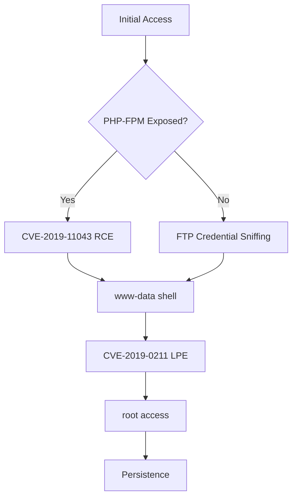

# Offensive Security Framework - AI Context

## Project Overview

This security audit framework provides a structured knowledge base for penetration testing activities targeting the Corporativo Global de Infraestructura (CGI) infrastructure.

## Target Summary

| Attribute | Value |
|-----------|-------|
| Organization | Corporativo Global de Infraestructura |
| Primary Domain | corp-infra.local |
| Network Zone | Z01-DMZ |
| IP Range | 201.131.132.0/24 |
| Primary Host | 201.131.132.131 |

## Risk Assessment Summary

```
┌─────────────────────────────────────────────┐
│           RISK DISTRIBUTION                 │
├─────────────────────────────────────────────┤
│ Critical: ████████████ 2                   │
│ High:     ████████████████████ 4            │
│ Medium:   0                                 │
│ Low:      0                                 │
├─────────────────────────────────────────────┤
│ TOTAL:    6 vulnerabilities                 │
└─────────────────────────────────────────────┘
```

## Critical Attack Vectors

### 1. CVE-2019-0211 (Apache LPE)
- **Type**: Local Privilege Escalation
- **Target**: Apache 2.4.38
- **Impact**: www-data → root
- **Exploit**: `/exploits/CVE-2019-0211/carpe-diem.php`
- **Reliability**: 87-95%

### 2. CVE-2019-11043 (PHP-FPM RCE)
- **Type**: Remote Code Execution
- **Target**: PHP 7.1.26 (PHP-FPM)
- **Impact**: Remote shell acquisition
- **Exploit**: `/exploits/CVE-2019-11043/metasploit.rb`
- **Reliability**: High

## Target Technology Stack (Vulnerable)

| Software | Version | Status | CVEs |
|----------|---------|--------|------|
| Apache | 2.4.38 | EOL | CVE-2019-0211, CVE-2019-10081 |
| PHP | 7.1.26 | EOL | CVE-2019-11043 |
| OpenSSL | 1.0.2q | EOL | CVE-2019-1547, CVE-2019-1559, CVE-2019-1563 |

## Recommended Exploitation Workflow



## File Structure

```
security-audit-framework/
├── manifest.json                    # Project metadata
├── schemas/                         # JSON validation schemas
│   ├── host-scan.schema.json
│   ├── port-scan.schema.json
│   └── cve-advisory.schema.json
├── infrastructure/                  # Scanned assets
│   ├── zones/Z01-DMZ/              # Network zone
│   └── ports/                       # Port scan results
├── vulnerabilities/                 # CVE advisories
│   ├── CVE-2016-1240/
│   ├── CVE-2019-0211/
│   ├── CVE-2019-11043/
│   ├── CVE-2019-1547/
│   ├── CVE-2019-1559/
│   ├── CVE-2019-1563/
│   ├── CVE-2019-10081/
│   ├── CVE-2021-21703/
│   └── CVE-2021-4034/
├── exploits/                        # Proof-of-concept code
│   ├── cve/
│   │   ├── CVE-2016-1240/
│   │   ├── CVE-2019-0211/
│   │   ├── CVE-2019-11043/
│   │   ├── CVE-2021-21703/
│   │   └── CVE-2021-4034/
│   ├── frameworks/samv5/
│   ├── implants/
│   └── platform/
├── software/                        # Software inventory
└── ai-context/                      # AI consumption context
```

## Quick Reference for AI Agents

### Primary Exploitation Path (Apache Root)
1. Deploy `apache_carpe_diem_lpe_cve_2019_0211.php` to target web server
2. Trigger via HTTP request
3. Wait for Apache graceful restart (logrotate)
4. Execute payload as root

### Linux Privilege Escalation (PwnKit)
1. Gain local access (any user)
2. Deploy `linux_pwnkit_lpe_cve_2021_4034.c`
3. Compile and execute for immediate root access (Critical)

### Secondary RCE Path (PHP-FPM)
1. Use Metasploit module (SAM-V5 style)
2. Target PHP-FPM for RCE (CVE-2019-11043)
3. Escalate via CVE-2021-4034 or CVE-2019-0211

## Data Consumption Guidelines

All JSON files include:
- `$schema` references for validation
- Consistent naming conventions (lowercase, hyphens)
- ISO 8601 timestamps
- CVSS scores and vectors
- Cross-references between entities
