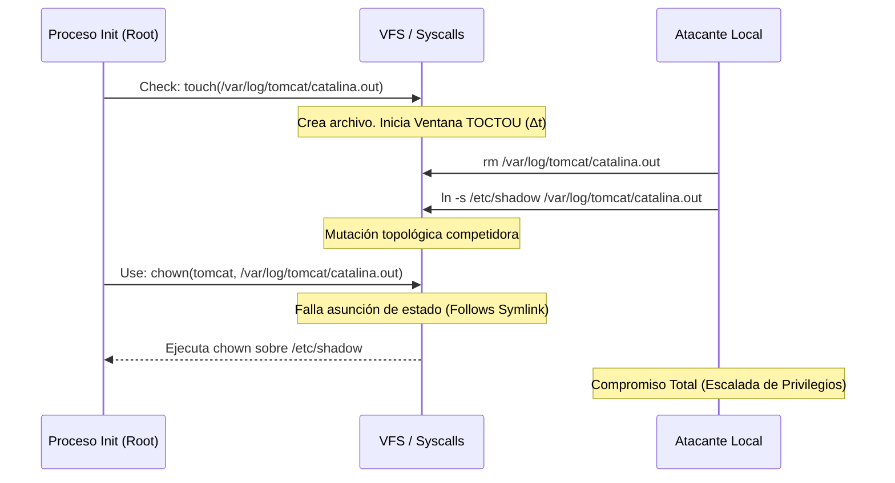

# CVE-2016-1240: Ruptura de Invariantes de Seguridad mediante TOCTOU en Fronteras de Privilegio

> [!WARNING]
> **Alta Severidad**: Esta vulnerabilidad representa una falla arquitectónica crítica en la gestión de estados efímeros, permitiendo una Escalada de Privilegios Locales (LPE) mediante condiciones de carrera en la resolución de enlaces simbólicos.

---

## Abstract Ejecutivo

El presente documento expone una disección técnica rigurosa de la vulnerabilidad catalogada como CVE-2016-1240. Aunque históricamente asociada al manejo inseguro de archivos por scripts de inicialización (como el de Tomcat), su taxonomía fundamental representa una falla arquitectónica crítica en la gestión de estados efímeros en sistemas tipo UNIX, extrapolable al comportamiento de utilidades como `systemd-tmpfiles`. La vulnerabilidad se materializa como una condición de carrera del tipo *Time-of-Check to Time-of-Use* (TOCTOU) durante el ciclo de creación y asignación de permisos (vía `chown`), permitiendo a un atacante con privilegios restringidos realizar un *symlink traversal* y lograr una Escalada de Privilegios Locales (LPE). Este análisis aborda la falla desde la perspectiva de la física de estados computacionales, evaluando la ventana de carrera (Race Window) temporal y sugiriendo mitigaciones que refuercen la topología de seguridad del entorno afectado.

## 1. Definición Formal de la Invariante de Seguridad Viable

Para garantizar la integridad del sistema durante la inicialización de servicios web en UNIX, se presupone la existencia de una invariante de confinamiento $I_{\text{conf}}$, la cual requiere que cualquier archivo de registro (log) y el directorio contenedor mantengan pertenencia exclusiva e inequívoca al usuario de servicio autorizado ($U_{srv}$, p. ej., `tomcat`). Matemáticamente, expresamos el estado deseado en el tiempo $t$ como:

$$ State(t) \models ( \text{owner}(\text{LogDir}) == U_{srv} \land \text{owner}(\text{LogFile}) == U_{srv} \land \exists! \text{ path}( \text{LogFile}) ) $$

Donde la afirmación "existe un único path" ($\exists! \text{ path}$) implica la ausencia categórica de manipulaciones topológicas, tales como enlaces simbólicos (symlinks) que desvíen la resolución del inodo apuntado.

## 2. Modelado de la Condición de Carrera (TOCTOU)

El script de inicialización introduce una desincronización crítica al no asegurar la atomicidad entre la creación del archivo de log por el usuario `root` y la posterior transferencia de propiedad (o cambio de permisos). La falla ocurre porque el estado del sistema puede ser mutado competitivamente por un atacante local ($U_{att}$) durante el intervalo de conmutación de contexto.

Sea el proceso legítimo ($P_{init}$) ejecutado con privilegios de `root`. La vulnerabilidad subyacente se puede esquematizar mediante la siguiente progresión lógica de la máquina de estados:

1. **Fase de Creación:** $P_{init}$ ejecuta la llamada al sistema para crear o vaciar el log:
    $$ \text{touch}(\text{/var/log/tomcat/catalina.out}) $$
    En el tiempo temporal $t_1$, se establece un punto de verificación (Check). Se presume erróneamente que la ruta resuelta es un archivo regular y legítimo.
2. **Ventana de Carrera ($\Delta t$):** En un intervalo $t_2$, donde $t_1 < t_2 < t_3$, el atacante local $U_{att}$, teniendo permisos de escritura sobre el directorio padre (o explotando su capacidad de modificar el objeto recién originado), reemplaza atómicamente el archivo con un enlace simbólico dirigido a un fichero crítico:
    $$ \text{symlink}(\text{"/etc/shadow"}, \text{"/var/log/tomcat/catalina.out"})$$
3. **Transferencia de Propiedad (Use):** En $t_3$, $P_{init}$ reasume su ejecución y ejecuta `chown` o un equivalente sobre el archivo, operando implícitamente sobre el inodo destino del *symlink traversal*:
    $$ \text{chown}(U_{srv}, \text{/var/log/tomcat/catalina.out}) $$

### Análisis del Fallo Lógico

El defecto fundamental reside en que el sub-estado del sistema en $t_3$ asume que las propiedades verificadas en $t_1$ persisten. La falta de aislamiento determinístico durante $\Delta t$ resulta en una operación `chown` que altera los permisos de un archivo arbitrario del sistema, subvirtiendo la Invariante Limitadora y facilitando LPE.

## 3. Identificación del Subdesbordamiento y Aislamiento

La resolución de `chown` sobre la ruta vulnerada no incorpora mecanismos que restrinjan el enlace simbólico a los dominios del file descriptor. En lugar de utilizar llamadas seguras con bloqueo de estado atómico (e.g., `fchown` apoyado con `O_NOFOLLOW`), se emplea una evaluación no acotada.

Para refactorizar la seguridad formal de este segmento de código y cerrar la ventana $\Delta t$, la política de mitigación debe imponer una atomicidad de estado irrompible. Esto puede lograrse, por ejemplo, asegurando que las operaciones críticas de pertenencia de archivos limiten su evaluación lexicográfica garantizando la ausencia de transiciones de directorio inesperadas.

La persistencia de esta condición TOCTOU resalta que la gestión de persistencia temporal requiere paradigmas de sincronización intrínseca de bajo nivel y una reevaluación ontológica respecto a cómo el sistema operativo UNIX define y protege los lindes de privilegios en escenarios transitorios.

---

## Referencias

* CVE-2016-1240 (NVD/MITRE)
* CWE-367: Time-of-Check to Time-of-Use (TOCTOU) Race Condition
* [LegalHackers Advisory - Dawid Golunski](https://legalhackers.com/advisories/Tomcat-DebPkgs-Root-Privilege-Escalation-CVE-2016-1240.html)
