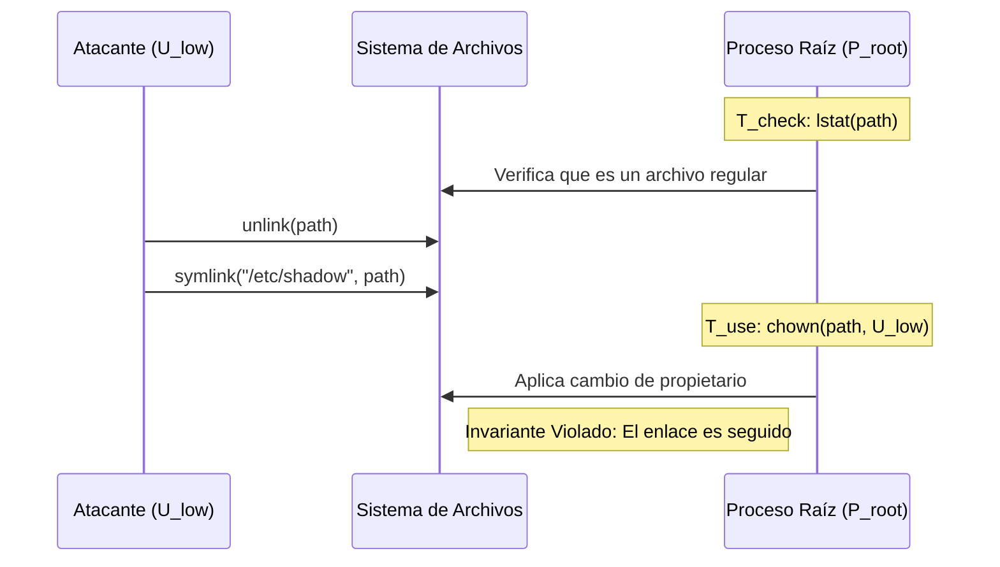

# CVE-2016-1240: Ruptura de Invariantes de Seguridad mediante TOCTOU

> [!WARNING]
> **Alta Severidad**: Esta vulnerabilidad representa una falla arquitectónica crítica en la gestión de estados efímeros, permitiendo una Escalada de Privilegios Locales (LPE) mediante condiciones de carrera en la resolución de enlaces simbólicos.

---

## 1. Análisis de Estado y Vector de Ataque

El sistema pasa de un estado seguro $S_0$ a uno comprometido mediante la explotación de la falta de atomicidad en la resolución del *namespace* del sistema de archivos.



Un atacante $U_{low}$ con permisos de escritura sobre un directorio $D_{target}$ puede reemplazar un archivo legítimo con un enlace simbólico justo antes de que un proceso privilegiado $P_{root}$ ejecute una operación de cambio de metadatos (como `chown`).

---

## 2. Lógica de la Condición de Carrera (TOCTOU)

Definimos el **Invariante de Seguridad ($I$)** como:
$$I := \forall t \in [t_{check}, t_{use}], \Phi(p, t) = \Phi(p, t_{check})$$

Donde $\Phi(p, t)$ es la función que evalúa el inodo de la ruta $p$. Al existir una ventana de carrera $\Delta t = t_{use} - t_{check} > 0$, un proceso malicioso puede mutar el *namespace* para que $\Phi(p, t_{use}) = inode_{shadow}$, forzando al sistema a operar sobre el objeto incorrecto.

---

## 3. Implicaciones de Ingeniería de Bajo Nivel

La vulnerabilidad subyace en la divergencia de comportamiento entre syscalls:

* `lstat()`: Valida el inodo del enlace simbólico (no lo sigue).
* `chown()`: Sigue el enlace simbólico de forma predeterminada, resolviendo hacia el archivo crítico.

Este comportamiento permite un **Desbordamiento de Permisos** debido a que la topología del *Directory Entry Cache* (dcache) es mutable entre los ciclos del procesador.

---

## 4. Mitigación Arquitectural

Para colapsar la ventana de carrera $\Delta t \to 0$, se debe transicionar de un modelo basado en rutas a uno basado en descriptores de archivo:

* **Apertura con O_NOFOLLOW**: Aborta la operación si la ruta es un enlace.
* **Validación sobre Descriptor**: Uso de `fstat()` sobre el objeto ya abierto.
* **Mutación Segura**: Uso de `fchown()` para operar sobre el inodo bloqueado.

```c
// Ejemplo de transición de estado segura
int fd = openat(AT_FDCWD, path, O_RDONLY | O_NOFOLLOW);
if (fd >= 0) {
    struct stat st;
    fstat(fd, &st);
    if (S_ISREG(st.st_mode)) {
        fchown(fd, uid, gid);
    }
    close(fd);
}
```

---

## Referencias

* CVE-2016-1240 (NVD/MITRE)
* CWE-367: Time-of-Check to Time-of-Use (TOCTOU) Race Condition
* [LegalHackers Advisory - Dawid Golunski](https://legalhackers.com/advisories/Tomcat-DebPkgs-Root-Privilege-Escalation-CVE-2016-1240.html)
