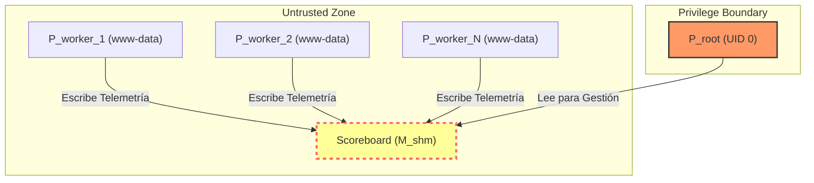
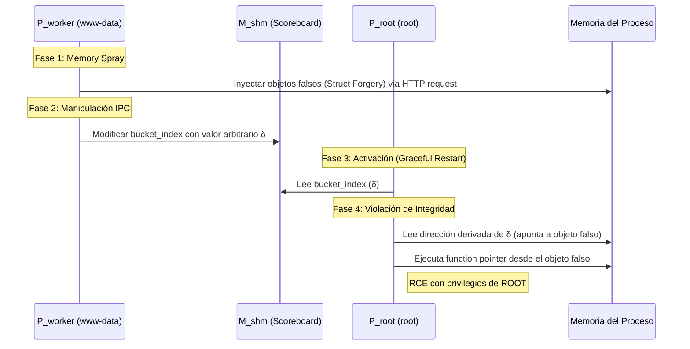

# CVE-2019-0211: CARPE DIEM - Escalada de Privilegios en Apache

> [!CAUTION]
> **Severidad Crítica**: CVE-2019-0211 representa una quiebra fundamental en la separación de privilegios del servidor HTTP Apache. Un proceso hijo con privilegios restringidos (`www-data`) puede secuestrar el flujo de ejecución del proceso padre (`root`) mediante la manipulación de la memoria compartida.

---

## 1. Contexto y Objetivos del Sistema

El sistema implementa un modelo de concurrencia basado en procesos secundarios (workers) y un gestor central (master). El objetivo central de seguridad es que un trabajador comprometido no pueda elevar sus privilegios para influir en otros trabajadores o en el administrador (`root`).

### Invariante Formal

Definimos el Invariante de Seguridad $\mathcal{I}_{sep}$ como:

> **$\mathcal{I}_{sep}$:** Todo dato proveniente de la memoria compartida ($M_{shm}$) debe ser validado rigurosamente antes de ser utilizado por el proceso maestro ($P_{root}$) para cualquier operación de gestión de recursos o flujo de control.

---

## 2. Arquitectura de Memoria Compartida (Scoreboard)

Apache utiliza el **Scoreboard** como un canal de comunicación IPC para monitorear el estado de los procesos.



### El Defecto de Confianza

El scoreboard (`ap_scoreboard_image`) contiene un campo `bucket` dentro de la estructura `parent[child_slot]`. Aunque el proceso maestro es el único que debería gestionar la asignación de buckets, el sistema **permite escritura** desde los procesos hijos a este campo, y el maestro lo lee para calcular direcciones de memoria durante un reinicio gradual (_graceful restart_).

---

## 3. Análisis de la Causa Raíz (Root Cause)

### Fragmento Crítico de Código

Durante un reinicio gradual (`SIGUSR1`), el proceso maestro ejecuta la lógica de limpieza de procesos hijos en `server/mpm/prefork/prefork.c`:

```c
// Ejecutado en contexto de P_root (UID 0)
int bucket_index = ap_scoreboard_image->parent[child_slot].bucket;

// VULNERABILIDAD: 'bucket_index' es leído directamente de M_shm y
// se usa como índice en un arreglo global sin validación de límites.
ap_mpm_pod_check(retained->buckets[bucket_index].pod);
```

### Primitiva de Lectura Fuera de Límites (OOB Read)

La dirección de destino se calcula como:
$$A_{target} = A_{base\_retained} + (I_{bucket} \cdot S_{bucket\_size})$$

Donde el atacante controla $I_{bucket}$. Al no existir la validación $0 \le I_{bucket} < N_{max\_buckets}$, el atacante puede forzar a $P_{root}$ a leer de cualquier dirección de memoria relativa a $A_{base\_retained}$.

---

## 4. Ciclo de Vida del Incumplimiento de Seguridad

La explotación se divide en una secuencia de eventos de manipulación de memoria diseñada para subvertir el flujo de control.



---

## 5. Primitivas Técnicas de Evasión

Para lograr la ejecución arbitraria, el ataque utiliza técnicas de **Data-Only Attack**:

1.  **Struct Forgery**: Construcción de una estructura `apr_proc_mutex_t` falsa en la memoria del proceso padre.
2.  **Type Confusion**: Engañar al proceso maestro para que trate una región de memoria controlada como una tabla de métodos legítima.
3.  **Function Pointer Hijack**: Sobrescribir los métodos de bloqueo (`meth->child_init`, `meth->acquire`, etc.) para apuntar al payload final.

### Tabla de Objetivos en Memoria

| Estructura                           | Campo Objetivo        | Efecto en Compromiso                          |
| :----------------------------------- | :-------------------- | :-------------------------------------------- |
| `ap_scoreboard_image`                | `parent[slot].bucket` | Control del índice de memoria (Primitiva OOB) |
| `apr_proc_mutex_unix_lock_methods_t` | `child_init`          | Redirección de $EIP/RIP$ a ejecución código   |
| `apr_proc_mutex_t`                   | `*meth`               | Control de la tabla de funciones virtuales    |

---

## 6. Análisis Formal de la Violación

Definimos el estado del sistema como $\Sigma$. La función de transición $\tau: \Sigma \times \Pi \rightarrow \Sigma$ es vulnerable si permite:
$$\exists \pi \in \Pi_{untrusted}, \exists \sigma \in \Sigma : \sigma' = \tau(\sigma, \pi) \implies \text{EIP}(P_{root}) \in \text{Range}(\pi)$$

En CVE-2019-0211, el trabajador $\pi_{worker}$ transiciona el sistema a un estado donde el puntero de instrucción del maestro se deriva de la entrada no confiable, invalidando la post-condición de seguridad del modelo MPM.

---

[[apache-2.4.38]] [[security-breach]] [[root-cause-analysis]]
