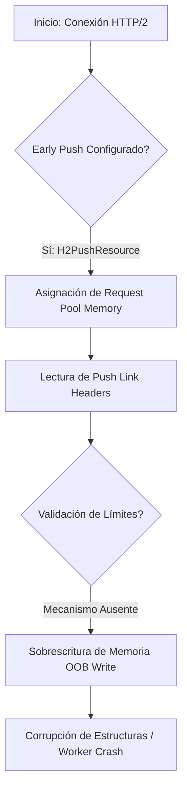

# CVE-2019-10081: Corrupción de Memoria en mod_http2 (OOB Write)

> [!CAUTION]
> **Aclaración Taxonómica Crítica**: Este identificador designa una vulnerabilidad de **escritura fuera de límites (Out-of-bounds Write)** en `mod_http2` de Apache HTTP Server, afectando la disponibilidad (Crash) y la integridad de la memoria. Se corrige la premisa anterior que lo identificaba erróneamente como un Use-After-Free (UAF).

---

## 1. Análisis Formal del Mecanismo de Fallo

El defecto reside en la fase de asignación de memoria durante un *push* temprano de HTTP/2 (`early pushes`). El servidor falla al validar los límites espaciales del buffer de destino en relación con los encabezados de enlace configurados.

### Violación de Invariante de Memoria

Sea $B_{pool}$ la capacidad del segmento de memoria asignado y $L_{headers}$ la longitud de la estructura de encabezados. La invariante de seguridad $L_{headers} \le B_{pool}$ se viola, resultando en:

$$\text{memcpy}(ptr, headers, L_{headers}) \implies \text{Sobrescritura del Heap if } L_{headers} > B_{pool}$$

---

## 2. Análisis de Flujo y Memoria



### Impacto en la Pila

La sobrescritura de estructuras adyacentes en el gestor de memoria (APR pools) provoca corrupción de punteros, resultando en un `SIGSEGV` cuando el hilo intenta liberar o asignar memoria dentro de ese pool comprometido.

---

## 3. Resiliencia y Mitigación

* **Memory Safety Fix**: Actualizar a Apache $\ge$ 2.4.41 para habilitar aserciones perimetrales.
* **Mitigación de Configuración**: Desactivar el soporte global para HTTP/2 Push:

    ```apache
    H2Push off
    ```

---

## 4. Evaluación del Modelo de Inyección (Contexto Teórico)

Aunque no se alinea con el CVE-2019-10081 real, el modelo de inyección lógicamente propuesto anteriormente describe la semántica de una vulnerabilidad **CWE-94 (Code Injection)**.

### Álgebra de Vulnerabilidad (Taint-Tracking)

$$f(S) \rightarrow \text{eval}(P + S_{malicioso})$$

El fallo radica en la tokenización léxica, donde caracteres de escape suministrados por el usuario se promocionan de literales a instrucciones de control dentro del AST (Abstract Syntax Tree).

---

## Referencias

* CVE-2019-10081 (NVD/MITRE)
* CWE-787: Out-of-bounds Write
* [Apache HTTP Server 2.4 Vulnerabilities](https://httpd.apache.org/security/vulnerabilities_24.html)
