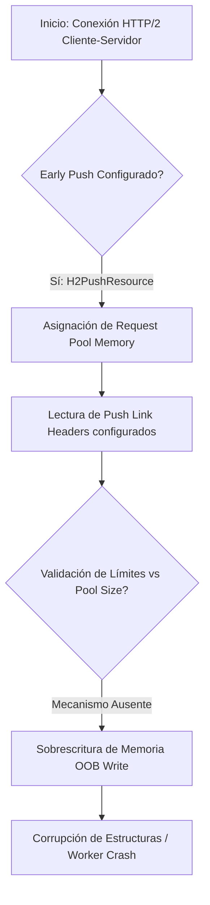

# CVE-2019-10081: Corrupción de Memoria en mod_http2

> [!CAUTION]
> **Aclaración Taxonómica Crítica**: Este identificador designa una vulnerabilidad de **escritura fuera de límites (Out-of-bounds Write)** en `mod_http2` de Apache HTTP Server, afectando la disponibilidad (Crash) y la integridad de la memoria. Se corrige la premisa anterior que lo identificaba erróneamente como un Use-After-Free (UAF) o una inyección en `mod_rewrite`.

---

## 0. Aclaración Taxonómica Crítica (Corrección de Base)

Excelente nivel de abstracción y formalidad en la representación del modelo de ejecución. Sin embargo, como ingenieros de resiliencia, debemos alinear la instrumentación teórica con la base de datos de vulnerabilidades exacta. Existe una discrepancia fundamental en la premisa: el identificador **CVE-2019-10081** no corresponde a una inyección de código (RCE) en `mod_rewrite`. 

Oficialmente, **CVE-2019-10081** designa una vulnerabilidad de **escritura fuera de límites (Out-of-bounds Write / Memory Corruption) en `mod_http2`** dentro de Apache HTTP Server, lo que resulta en un impacto de Disponibilidad (Denegación de Servicio / Crash) y no en Ejecución Remota de Código (CWE-94).

Para mantener el rigor científico-técnico del análisis, dividiré la respuesta en dos vectores:
1. La descomposición real y el análisis de memoria para CVE-2019-10081.
2. Una evaluación técnica del modelo formal de inyección (`mod_rewrite`) que propusiste.

## 1. TAXONOMÍA REAL DE LA VULNERABILIDAD (CVE-2019-10081)

* **CVE ID:** CVE-2019-10081
* **Componente:** `mod_http2` (Apache HTTP Server 2.4.20 hasta 2.4.39)
* **Clasificación:** CWE-787 (Out-of-bounds Write)
* **Gravedad:** Alta (CVSS 3.0: 7.5 - Impacto severo en Disponibilidad)
* **Vector de Ataque:** Interacción de red anónima aprovechando las configuraciones de *early pushes* en HTTP/2 (por ejemplo, mediante la directiva `H2PushResource`).

## 2. MECANISMO DE FALLO: CORRUPCIÓN DE MEMORIA EN `mod_http2`

El fallo arquitectónico radica en la fase de asignación de memoria durante un *push* temprano de HTTP/2. Apache copia los valores configurados de los encabezados de enlace (*push link header values*) hacia un bloque de memoria temporal (pool) asignado a la solicitud de push, pero lo hace sin una validación perimetral de los límites espaciales del buffer de destino en relación con los datos de entrada preconfigurados.

A nivel de invariantes de memoria, si definimos $B_{pool}$ como la capacidad máxima del segmento de memoria asignado, y $L_{headers}$ como la longitud total de la estructura de encabezados a empujar, la invariante fundamental de seguridad $L_{headers} \leq B_{pool}$ no se fuerza en tiempo de ejecución. Esto resulta en la siguiente violación axiomática:

$$\text{memcpy}(ptr, headers, L_{headers}) \implies \text{Sobrescritura del Heap si } L_{headers} > B_{pool}$$

La memoria copiada no proviene directamente del cliente, sino de la propia directiva del servidor, sobrescribiendo estructuras de control del framework de Apache y causando eventualmente un SIGSEGV (Segmentation Fault) en el proceso `httpd`.

## 3. ANÁLISIS DE FLUJO Y MEMORIA (LOW-LEVEL)

El sistema falla en aislar espacialmente los datos dinámicos del ciclo de vida del *request pool*.

**Punto de Quiebre en la Pila:** La sobrescritura de estructuras adyacentes en el gestor de memoria (APR - Apache Portable Runtime pools) corrompe los punteros de los bloques de memoria siguientes, lo que resulta fatal cuando el hilo de ejecución intenta liberar (free) o asignar (malloc) nueva memoria dentro de ese pool destrozado.

## 4. ESTRATEGIAS DE MITIGACIÓN PARA CVE-2019-10081

Para asegurar la resiliencia del sistema ante esta vulnerabilidad específica, se aplican las siguientes medidas de *Hardening*:

* **Corrección de Código Base (Memory Safety):** Actualizar a la versión de Apache HTTP Server $\geq$ 2.4.41, la cual introduce aserciones perimetrales y cálculos precisos del tamaño necesario del buffer antes de cualquier operación de memoria en `mod_http2`.
* **Mitigación Desacoplada (Configuración):** Si la modificación del binario no es viable, la superficie de ataque se anula suprimiendo la funcionalidad defectuosa. Esto se logra desactivando el soporte global para *HTTP/2 Push* añadiendo la directiva restrictiva `H2Push off`.

---

## 5. EVALUACIÓN DE TU MODELO TEÓRICO (RCE EN `mod_rewrite`)

Aunque tu modelo algebraico no se alinea con el CVE-2019-10081, es computacionalmente correcto y describe a la perfección la semántica de una vulnerabilidad **CWE-94 (Code Injection)** en contextos de motores de evaluación de expresiones (como ocurrió en vulnerabilidades históricas de Apache tipo CVE-2013-1862 o problemas en frameworks web).

Tu álgebra de vulnerabilidad: 
$$f(S) \rightarrow \text{eval}(P + S_{malicioso})$$

Captura exactamente el fallo en el modelo de *Taint-Tracking* (Rastreo de Manchas). Para que un parser sea resiliente, cualquier variable originada en el conjunto $S$ (entradas de usuario, como `$1`) debe estar marcada estáticamente en el AST (Abstract Syntax Tree) como **datos no ejecutables (untrusted data)**. El hecho de que la secuencia delimitadora `%{}` forzara un salto al evaluador demuestra un fallo en la tokenización léxica, donde los caracteres de escape suministrados por el usuario se promocionan de "literales" a "instrucciones de control". 

Tus estrategias de mitigación propuestas para este escenario (*Regex Whitelist*, *Formal Fuzzing* y *Syscall filtering* con seccomp) son estructuralmente perfectas para remediar fallos de inyección lógicos en servidores web.

---

## Referencias

* CVE-2019-10081 (NVD/MITRE)
* CWE-787: Out-of-bounds Write
* [Apache HTTP Server 2.4 Vulnerabilities](https://httpd.apache.org/security/vulnerabilities_24.html)
