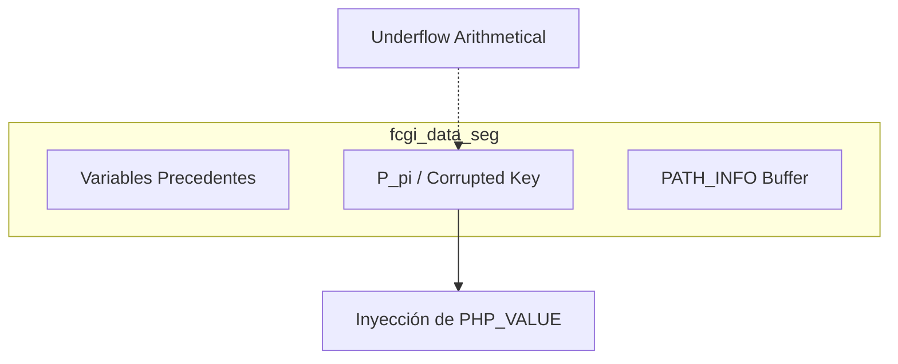

# CVE-2019-11043: PHUIP - Análisis Estructural y Matemático

> [!CAUTION]
> **Severidad Crítica**: El CVE-2019-11043 no es solo una falla de desbordamiento; es una violación de los invariantes de memoria causada por una desincronización de estados entre NGINX y PHP-FPM.

---

## 1. Definición Formal del Sistema (NGINX + PHP-FPM)

Sea un sistema distribuido $\mathcal{S}$ compuesto por dos procesos concurrentes:
* $\mathcal{N}$: El proxy inverso (NGINX).
* $\mathcal{F}$: El intérprete de backend (PHP-FPM).

La comunicación se rige por un conjunto de variables de entorno $E$ transmitidas a través del protocolo FastCGI.

```mermaid
graph LR
    User[Atacante] -- "URI con %0a" --> Nginx[NGINX (N)]
    Nginx -- "V_script, V_path" --> PHP[PHP-FPM (F)]
    PHP -- "Pointer Underflow" --> Memory[Heap Corruption]

    subgraph "Desincronización de Estados"
        Nginx
        PHP
    end
```

Para un URI dado, $\mathcal{N}$ debe particionarlo utilizando la regla:
`^(.+?\.php)(/.*)$`

Si el URI contiene un salto de línea de control codificado (`%0a`), la expresión regular falla, produciendo un estado donde $\mathcal{N}$ transfiere un $V_{path}$ vacío o nulo a $\mathcal{F}$.

---

## 2. Violación del Invariante de Memoria (El Subdesbordamiento)

El núcleo de la vulnerabilidad reside en `sapi/fpm/fpm/fpm_main.c`. Sea $P_{env}$ un puntero base a `PATH_INFO`. La operación aritmética se define como:

$$P_{pi} = P_{env} + L_{pilen} - L_{slen}$$

### Prueba Analítica de la Falla

En condiciones nominales, $L_{pilen} \ge L_{slen} \implies P_{pi} \ge P_{env}$.
Con la anomalía léxica (`%0a`), $L_{pilen} = 0$ y $L_{slen} > 0$:

$$P_{pi} = P_{env} - L_{slen} \implies P_{pi} < P_{env}$$

Esto constituye un **Underflow determinista**, donde $P_{pi}$ apunta a una dirección de memoria *anterior* al buffer asignado.

---

## 3. Explotación: Corrupción del Heap Layout

Al forzar el subdesbordamiento, el atacante puede manipular la estructura `fcgi_data_seg` que almacena variables de entorno contiguas.



### Inyección de Variables PHP_VALUE

Mediante el control exacto de $L_{slen}$, el atacante alinea $P_{pi}$ para corromper las claves/valores de variables precedentes, inyectando directivas INI:

* 1. **auto_prepend_file**: Ejecuta el payload HTTP como código PHP.
* 2. **extension**: Carga bibliotecas `.so` maliciosas.

---

## 4. Conclusión de Ingeniería

El CVE-2019-11043 es un fallo de clase `CWE-119` y `CWE-787`. La raíz es el **acoplamiento temporal de asunciones**: $\mathcal{F}$ confió en la validación léxica de $\mathcal{N}$. Al romperse el invariante aritmético, el sistema transiciona a un estado de compromiso total.

---

## Referencias

* [Bug PHP #78599](https://bugs.php.net/bug.php?id=78599)
* [NVD - CVE-2019-11043](https://nvd.nist.gov/vuln/detail/CVE-2019-11043)
* [Exploit Original (phuip-fpizdam)](https://github.com/neex/phuip-fpizdam)
