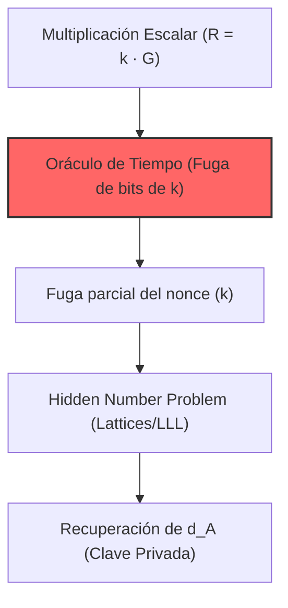

# CVE-2019-1547: Fuga de Información de Canal Lateral en Firmas ECDSA

> [!CAUTION]
> **Severidad Crítica (Contexto Criptográfico)**: Esta vulnerabilidad permite la extracción determinística de claves privadas ECDSA mediante el análisis de fugas de microarquitectura (timing side-channels) en OpenSSL.

---

## 1. Análisis Matemático de la Firma ECDSA

La seguridad de ECDSA reside en el Problema del Logaritmo Discreto de Curva Elíptica (ECDLP). Durante la firma, se vinculan el nonce efímero ($k$) y la clave privada ($d_A$):

$$s\equiv k^{-1}(z+r\cdot d_A)\pmod{n}$$



Cualquier fuga de información sobre la estructura de bits del nonce $k$ compromete la clave privada mediante aislamiento algebraico:
$$d_A\equiv r^{-1}(s\cdot k-z)\pmod{n}$$

---

## 2. Mecánica de la Vulnerabilidad: El Oráculo de Tiempo

La vulnerabilidad ocurre cuando OpenSSL falla al habilitar algoritmos de tiempo constante (*Constant-Time*) al usar curvas con parámetros explícitos que omiten el cofactor.

### Asimetría Computacional

El motor matemático revierte su comportamiento a algoritmos como *Double-and-Add* no cegados. La latencia inducida por predicciones de salto erróneas (*Branch misprediction*) en la tubería del procesador correlaciona con el valor binario del bit secreto del nonce.

---

## 3. Contraste de Implementación

### [Vulnerable]: Double-and-Add (Non-Constant Time)
La ramificación condicional depende directamente del secreto, filtrando bits de 'k'.

```c
Point EC_Scalar_Mult_Vulnerable(BigInt k, Point G) {
    Point Q = PointAtInfinity;
    for (int i = 255; i >= 0; i--) {
        Q = PointDouble(Q);
        if (get_bit(k, i) == 1) {   // <-- ORÁCULO DE TIEMPO
            Q = PointAdd(Q, G);
        }
    }
    return Q;
}
```

### [Resiliente]: Montgomery Ladder (Constant-Time)
Ejecución isomórfica. El consumo de ciclos es independiente del escalar $k$.

```c
Point EC_Scalar_Mult_Resilient(BigInt k, Point G) {
    Point R[2];
    R[0] = PointAtInfinity; R[1] = G;
    for (int i = 255; i >= 0; i--) {
        int bit = get_bit(k, i);
        // Operaciones siempre ejecutadas (isomorfismo)
        R[1 ^ bit] = PointAdd(R[bit], R[1 ^ bit]);
        R[bit]     = PointDouble(R[bit]);
    }
    return R[0];
}
```

---

## 4. Mitigación y Resiliencia

* **Scalar Blinding**: Enmascarar el nonce ($k'=k+\lambda\cdot n$) para eliminar la correlación temporal.
* **Algoritmos Libres de Ramificación**: Implementar métodos como la *Montgomery ladder* que utilicen instrucciones `CMOV` u operaciones bit a bit lógicas en lugar de saltos condicionales.

---

## Referencias

* CVE-2019-1547 (NVD/MITRE)
* CWE-203: Information Exposure Through Observable Discrepancy
* [OpenSSL Security Advisory [6 March 2019]](https://www.openssl.org/news/secadv/20190306.txt)
