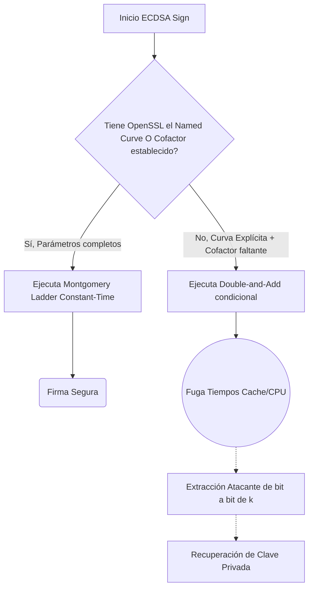

# CVE-2019-1547: Análisis Formal de Fuga de Información de Canal Lateral en Firmas ECDSA

> [!CAUTION]
> **Severidad Crítica (Contexto Criptográfico)**: Esta vulnerabilidad permite la extracción determinística de claves privadas ECDSA mediante el análisis de fugas de microarquitectura (timing side-channels) en OpenSSL.

---

## Resumen Ejecutivo

La vulnerabilidad CVE-2019-1547 identifica un fallo crítico en la resiliencia criptográfica de la biblioteca libcrypto en OpenSSL (versiones 1.1.1, 1.1.0 y 1.0.2). El defecto se manifiesta como una fuga de información de canal lateral (*Side-Channel leakage*) durante el proceso de firma con el Algoritmo de Firma Digital de Curva Elíptica (ECDSA). Cuando se instancian curvas utilizando parámetros explícitos que omiten la definición del cofactor matemático, la implementación de OpenSSL falla al habilitar los algoritmos de mitigación temporal. Esto permite que un atacante local, mediante instrumentación de microarquitectura y análisis estadístico, extraiga el nonce efímero de la firma y recupere determinísticamente la clave privada completa.

## Análisis Matemático y Microarquitectural

### 1. El Riesgo Algebraico del Nonce Efímero en ECDSA

La ecuación central para la generación de la firma $s$ en ECDSA se define como:

$$ s = k^{-1} (H(m) + r \cdot d_A) \pmod n $$

Donde:
*   $k$ es el nonce efímero criptográficamente seguro (debe ser estrictamente uniforme temporal y aleatoriamente para cada firma).
*   $H(m)$ es el hash del mensaje.
*   $r$ es el componente espacial de la firma (coordenada $x$ del punto $k \cdot G$).
*   $d_A$ es la clave privada (el secreto a largo plazo).
*   $n$ es el orden del punto generador $G$.

La vulnerabilidad no reside en una debilidad algebraica del ECDSA en sí, sino en la **fuga del valor de $k$ a través del canal lateral**. Si un atacante logra recuperar $k$ (incluso parcialmente, en un ataque de bits filtrados), la recuperación de la clave privada $d_A$ es matemáticamente trivial e inmediata mediante álgebra modular elemental:

$$ d_A = r^{-1} (s \cdot k - H(m)) \pmod n $$

### 2. Mecánica del Oráculo de Tiempo (Time-of-Execution Oracle)

El problema de software radicaba en cómo OpenSSL procesaba el grupo de la curva elíptica (`EC_GROUP`). Históricamente, las implementaciones ingenuas de criptografía de curva elíptica utilizan algoritmos de multiplicación escalar (como doble y suma - *double-and-add*) que exhiben latencias condicionales detectables derivadas del patrón de bits del secreto $k$. 

Para mitigar esto, OpenSSL enmascara las operaciones mediante hardware de tiempo constante (Constant-Time). Sin embargo, el fallo **CVE-2019-1547** crea un cortocircuito en esta resiliencia algorítmica: 
Si se provee una curva con **parámetros explícitos** (en contraste con un *Named Curve* predefinido), y el `EC_GROUP` resultante **no tiene configurado explícitamente el valor del cofactor** (`cofactor` nulo o ausente), OpenSSL degrada silenciosamente la pila criptográfica, omitiendo el uso de la *Montgomery Ladder* invariante en el tiempo y revirtiendo a un algoritmo vulnerable a análisis de tiempos de ejecución de temporización de CPU (como Flush+Reload o Prime+Probe en la capa de microarquitectura L1/L3 Cache).

### 3. Anatomía Comparativa del Fallo de Implementación a Nivel Código

En la implementación susceptible, se omitió un "Guard Clause" crítico para un modelo de programación defensiva, permitiendo que la bifurcación lógica habilitara la rama no resiliente sin alertar al invocador:

**Código de la ruta de inicialización defectuoso (Conceptual):**
```c
/* Ruta defectuosa en OpenSSL */
if (group->cofactor == NULL) {
   // FALTA DE INVARIANTE: Omitió inicializar el enmascaramiento Constant-Time.
   // Se procederá con multiplicaciones de punto escalares susceptibles a 
   // análisis de diferencias de ciclo de reloj (Timing Attack).
   ejecutar_ecdsa_sin_mitigacion(k); // El tiempo de ejecución se correlaciona bit a bit con k.
} else {
   // Rama resiliente normal
   ejecutar_ecdsa_tiempo_constante_con_ladder(k); 
}
```



## Evaluación Formal Táctica

En conclusión, la severidad del **CVE-2019-1547** estriba en una violación sutil de precondiciones topológicas (la falta de definición formal del espacio algebraico completo mediante el cofactor). Un adversario empoderado metodológicamente (ej., en entornos compartidos en la nube - multitenant) usaría telemetría de monitoreo de ciclos (ej., la instrucción de ensamblador `RDTSC`) para reconstruir el material de las llaves en vuelo y romper de golpe el secreto de todo el material protegido bajo ECDSA.

---

## Referencias

* CVE-2019-1547 (NVD/MITRE)
* CWE-203: Information Exposure Through Observable Discrepancy
* [OpenSSL Security Advisory [6 March 2019]](https://www.openssl.org/news/secadv/20190306.txt)
