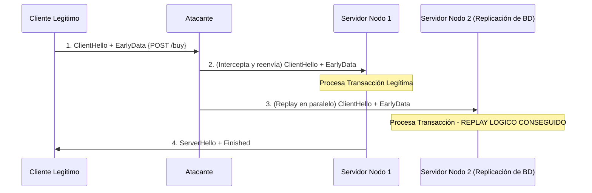

# CVE-2019-1559: Análisis Formal y de Resiliencia de 0-RTT Data Replay en TLS 1.3

> [!NOTE]
> *Nota técnica inicial:* A nivel de taxonomía de vulnerabilidades, **CVE-2019-1559** está indexada primariamente como una falla de tipo *Padding Oracle* en la implementación de `SSL_shutdown()` en OpenSSL, afectando canales TLS 1.2. Sin embargo, el riesgo arquitectónico de **0-RTT Data Replay en TLS 1.3** es un vector independiente y crítico inherente a la especificación del protocolo (RFC 8446). A continuación, procedo con el desglose analítico estricto sobre este mecanismo de repetición en TLS 1.3.

---

## 1. Análisis Teórico (Matemático/Criptográfico)

### 1.1. Derivación de Claves 0-RTT y la Ausencia de Intercambio Efímero
El protocolo TLS 1.3 introduce el modelo 0-RTT basándose en un *Pre-Shared Key* (PSK) derivado de la sesión anterior (o aprovisionado *out-of-band* a través del *Resumption Master Secret*). La vulnerabilidad fundamental radica en que los datos iniciales se cifran utilizando una clave (`early_data_key`) derivada exclusivamente del PSK y metadatos de la sesión anterior, **sin la contribución efímera ($g^y$) del primer vuelo del servidor**.

Esto implica que la propiedad de **Perfect Forward Secrecy (PFS)** se rompe transitoriamente para esta carga útil, exponiéndola además a un ataque de reenvío.

### 1.2. Falta de Frescura (Freshness) Matemática
En lógica clásica de protocolos criptográficos (p. ej. usando el formalismo BAN logic o cálculo Pi), la propiedad de inyectividad de un mensaje ($m$) entre entidades ($A$ y $S$) requiere el enlazamiento criptográfico de un elemento probabilístico fresco (como un *nonce* o un valor Diffie-Hellman efímero aportado en tiempo real). 

Dado que el bloque `EarlyData` en 0-RTT carece de la respuesta del servidor (ServerHello), la prueba formal demuestra que no existe una garantía de *freshness* comprobable por el motor criptográfico en este estado:

$$\exists A : A \xrightarrow{} S_{n} : \{M\}_{Key_{early}} \implies S_{n} \models \neg\sharp(M)$$

Donde $\sharp(M)$ denota la unicidad del mensaje. En consecuencia, la especificación en sí misma (RFC 8446, sección 8) reconoce el riesgo del *0-RTT Data Replay*.

## 2. Aplicación a Infraestructuras de Microservicios (El Fallo TOCTOU Distribuido)

Cuando la entidad ($A$) retransmite un *ClientHello* válido (que incluye la extensión `early_data`) hacia múltiples nodos de un clúster balanceado ($S_1, S_2, ... S_n$), se presenta una condición de carrera distribuida: un *Time-of-Check to Time-of-Use* (TOCTOU) macroestructural.

1. **Aceptación de ticket (Check):** Varios nodos validan matemáticamente el ticket PSK presentado.
2. **Desencriptación temprana y Ejecución (Use):** Si los nodos no poseen un estado compartido bloqueante y determinístico que registre la unicidad del ticket ($ClientHello\_Hash$), los nodos paralelos ejecutarán la carga útil (`POST /buy`) múltiples veces.

## 3. Modelado de Resiliencia y Función de Transición

Las implementaciones de servidores resilientes ante este ataque deben forzar lógicamente la aserción de frescura $\sharp(M)$ en la capa de transporte, utilizando estructuras externas (p. ej., memcached o Redis) llamadas *Strike Registers*.

Para que el sistema sea criptográficamente seguro, la función de transición para procesar *Early Data* ($T(e)$) debe modelarse estocásticamente bajo un límite de tiempo estricto ($W$, ventana de repetición máxima aceptable):

$$
T(e) = 
\begin{cases} 
\bot (\text{Drop}), & \text{si } \Delta t > W \\
\bot (\text{Drop}), & \text{si } \exists h \in StrikeRegister \mid h == \mathcal{H}(ClientHello) \\
\top (\text{Accept}) \land (StrikeRegister \leftarrow h), & \text{si } \Delta t \le W \land h \notin StrikeRegister
\end{cases}
$$

Donde $h$ es un *hash computation* sobre los elementos vinculantes del `ClientHello` y $\Delta t$ es la variación de edad del ticket.

Dado el costo en latencia que esto impone sobre despliegues distribuidos globalmente, la resiliencia arquitectónica más común opta por perfilar a nivel HTTP limitando semánticamente el 0-RTT:

* Solo permitir tráfico idiosincráticamente "seguro" o métodos HTTP idempotentes (`GET`, `HEAD`) dentro de la estructura de *EarlyData*, rechazando rígidamente operaciones de mutación de estado (p. ej., `POST`, `PUT`, `DELETE`).

---

## Referencias

* CVE-2019-1559 (NVD/MITRE)
* RFC 8446 - The Transport Layer Security (TLS) Protocol Version 1.3
* CWE-294: Authentication Bypass by Capture-replay
