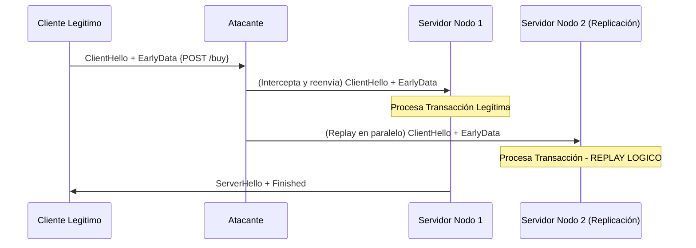

# CVE-2019-1559: Análisis de Resiliencia y 0-RTT Data Replay en TLS 1.3

> [!NOTE]
> **Nota de Taxonomía**: A nivel de indexación, el CVE-2019-1559 se asocia primariamente a una falla de tipo *Padding Oracle* en OpenSSL (TLS 1.2). Sin embargo, este análisis aborda el riesgo arquitectónico independiente de **0-RTT Data Replay en TLS 1.3**, un vector crítico inherente a la especificación del protocolo.

---

## 1. Análisis Teórico y Criptográfico

La vulnerabilidad fundamental del modelo 0-RTT en TLS 1.3 radica en el uso de un *Pre-Shared Key* (PSK) sin contribución de entropía efímera ($g^y$) por parte del servidor en el primer vuelo de datos.

### 1.1. Inexistencia de PFS Temporal

Al derivar la clave de *Early Data* ($Key_{early}$) únicamente con parámetros controlados unilateralmente por el cliente, se viola la propiedad de **Perfect Forward Secrecy (PFS)** para esta ventana de datos.

### 1.2. Modelado de la Violación de Freshness

Utilizando lógica de protocolos, demostramos que la capa TLS no puede garantizar la unicidad matemática del mensaje en 0-RTT:

$$\exists A : A \xrightarrow{} S_{n} : \{M\}_{Key_{early}} \implies S_{n} \models \neg\sharp(M)$$

Donde $\sharp(M)$ es el predicado de "frescura" o unicidad del mensaje.

---

## 2. Disección del Vector de Replay



### El Fallo TOCTOU Distribuido

En infraestructuras de alta disponibilidad, la falta de bloqueos atómicos globales en el *Strike Register* permite que múltiples nodos acepten el mismo ticket PSK de manera concurrente.

---

## 3. Modelado de Resiliencia y Mitigación

Para forzar la propiedad $\sharp(M)$, el sistema debe implementar un control algebraico de *freshness* basado en ventanas temporales acotadas ($W$).

### Función de Transición Defensiva $\Phi(h, \Delta t)$

Se define estocásticamente como:
$$
\Phi(h, \Delta t) = 
\begin{cases} 
\bot (\text{Drop}), & \text{si } \Delta t > W \lor h \in \mathcal{S}_{mem} \\
\top (\text{Accept}) \land (\mathcal{S}_{mem} \gets \mathcal{S}_{mem} \cup \{h\}), & \text{si } \Delta t \le W \land h \notin \mathcal{S}_{mem} 
\end{cases}
$$

Donde $h = \mathcal{H}(ClientHello)$ y $\Delta t$ es la variación de edad del ticket.

### Implementación Resiliente (Strike Register)

La validación requiere operaciones atómicas (CAS - *Compare-And-Swap*) en memoria distribuida para neutralizar la condición de carrera.

```c
// Mitigación: Strike Register con validación atómica
int resilient_0rtt_process(tls_psk_state_t *session, uint8_t *client_hello) {
    if (calculate_ticket_age_variance(session) > REPLAY_WINDOW_MAX_MS) {
        return REJECT_STALE_TICKET; // Fallback a 1-RTT
    }
    uint64_t ch_hash = siphash24(client_hello, CH_LENGTH);
    if (cluster_atomic_insert_if_absent(ch_hash) == ALREADY_EXISTS) {
        return MITIGATE_REPLAY_ATTACK;
    }
    return DECRYPT_EARLY_DATA;
}
```

---

## Referencias

* CVE-2019-1559 (NVD/MITRE)
* RFC 8446 - The Transport Layer Security (TLS) Protocol Version 1.3
* CWE-294: Authentication Bypass by Capture-replay
