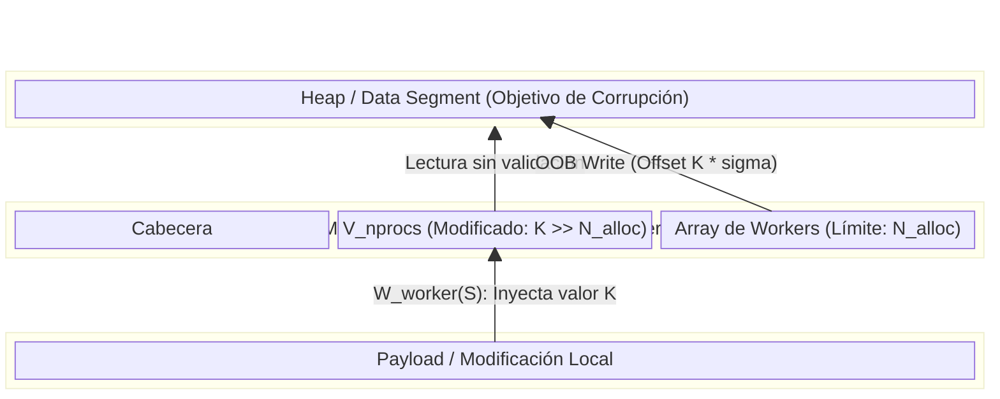

# Análisis de Causa Raíz Formal: CVE-2021-21703 (PHP-FPM)

## 1. Axiomatización y Topología de Memoria (PHP-FPM Scoreboard)

Sea un sistema operativo con aislamiento de memoria virtual. Definimos el espacio de memoria global del proceso maestro (root) como $M_{master}$ y el espacio del proceso trabajador (worker/www-data) como $M_{worker}$.

El diseño de PHP-FPM implementa una región de memoria compartida (SHM) denominada *scoreboard*, mapeada mediante `mmap()`, que denotaremos como el conjunto $S$. Topológicamente, $S \subset (M_{master} \cap M_{worker})$.

La estructura del *scoreboard* en memoria contigua puede axiomatizarse como una tupla funcional:
$$\Sigma = \langle A_{base}, N_{alloc}, V_{nprocs}, \Omega_{procs} \rangle$$

Donde:
* $A_{base} \in \mathbb{N}$: Dirección base del segmento SHM.
* $N_{alloc} \in \mathbb{N}$: Límite estricto de workers pre-asignados (invariante de diseño, `pm.max_children`).
* $V_{nprocs}$: Valor escalar mutable en $S$ que representa los workers activos.
* $\Omega_{procs}$: Arreglo contiguo de estructuras `fpm_scoreboard_proc_s` de tamaño $\sigma$.

El dominio espacial de $\Omega_{procs}$ está estrictamente acotado por:
$$D(\Omega) = [A_{base} + \delta, A_{base} + \delta + (N_{alloc} \cdot \sigma)]$$
Donde $\delta$ es el *offset* de la cabecera del scoreboard.

## 2. Modelado Algebraico de la Condición de Carrera/Corrupción (CVE-2021-21703)

La vulnerabilidad emerge de una asunción de confianza rota. El proceso maestro utiliza el valor de $V_{nprocs}$ (que reside en $S$ y es escribible por el worker) como límite superior para la iteración y cálculo de punteros, sin aplicar una función de acotamiento local.

Sea la función de cálculo del puntero del trabajador $i$-ésimo evaluada por el maestro:
$$P(i) = A_{base} + \delta + (i \cdot \sigma)$$

Bajo la operación nominal, el sistema mantiene el invariante:
$$\forall i \in [0, V_{nprocs} - 1], \quad V_{nprocs} \le N_{alloc} \implies P(i) \in D(\Omega) \subset S$$

**El vector de ataque (Corrupción de Estado):**
Un atacante con ejecución de código en el worker modifica el valor en memoria compartida, inyectando un estado anómalo tal que:
$$V_{nprocs}' = K \quad \text{donde} \quad K \gg N_{alloc}$$

Al evaluar el maestro la iteración para la sincronización de estado, calcula el puntero para un índice $\hat{i} > N_{alloc}$:
$$P(\hat{i}) = A_{base} + \delta + (\hat{i} \cdot \sigma)$$

Dado que el tamaño del mapeo SHM es estático, el acceso resultante diverge del conjunto $S$:
$$P(\hat{i}) \notin S \implies P(\hat{i}) \in $M_{master}^{private}$

Si $\exists \hat{i}$ tal que $P(\hat{i})$ colisiona con una dirección de puntero de función (e.g., GOT, estructuras zend, punteros de retorno en heap) en el espacio de $M_{master}$, la subsiguiente operación de escritura del maestro:
$$M_{master}[P(\hat{i})] \leftarrow \text{estado\_worker}$$
constituye una primitiva de escritura fuera de límites (OOB Write), rompiendo el modelo de integridad de control (CFI) y escalando privilegios a `root`.

## 3. Representación a Nivel de Sistema (C & Estructuras de Datos)

A nivel de C, la desincronización entre la asignación y la lectura se manifiesta en la evaluación directa de la estructura sin *bounds checking*.

```c
/* Estructura en memoria compartida (S) */
struct fpm_scoreboard_s {
    // ...
    unsigned int nprocs; // Vulnerable: Modificable por worker
    struct fpm_scoreboard_proc_s *procs[]; // Variable length array
};

/* Lógica del Master (Evaluación vulnerable) */
void fpm_scoreboard_update() {
    struct fpm_scoreboard_s *scoreboard = fpm_scoreboard_get();
    
    // CVE-2021-21703: nprocs es controlado por el atacante
    for (int i = 0; i < scoreboard->nprocs; i++) {
        struct fpm_scoreboard_proc_s *proc = scoreboard->procs[i];
        
        // Puntero 'proc' es ahora un puntero a M_master^private
        // La actualización corrompe la memoria del master:
        proc->used = 1; 
        proc->pid = current_pid; 
    }
}
```

**Dinámica de registros en Ensamblador (x86_64):**
El cálculo del offset se traduce en un desbordamiento de las instrucciones de direccionamiento indirecto.
```nasm
; rbx contiene A_base (puntero al scoreboard)
; eax contiene V_nprocs (inyectado por el atacante, ej. 0xFFFFFF)
mov eax, dword [rbx + offset_nprocs] 

; Bucle de inicialización
xor rcx, rcx                ; i = 0
.loop:
cmp rcx, rax                ; i < nprocs ?
jge .end_loop

; Cálculo de P(i) = Base + offset_procs + (i * sizeof(ptr))
; Si rcx > N_alloc, rdx apuntará fuera del mmap original
lea rdx, [rbx + rcx*8 + offset_procs]

; Corrupción OOB (Ejecución como root)
mov qword [rdx], r8         ; Escritura arbitraria en memoria del maestro
inc rcx
jmp .loop
```

## 4. Diagrama Topológico de la Vulnerabilidad (Mermaid)

El siguiente diagrama de estados topológicos muestra la proyección del vector de ataque sobre los límites del mapeo de memoria.



## 5. Demostración de la Corrección (Invariante de Seguridad Restaurado)

La resolución formal exige la reintroducción de una función de acotamiento $\Phi(x)$ que fuerce al valor leído a respetar el dominio espacial de $S$. 

Definimos la corrección mediante la restricción de la lectura de memoria compartida contra una variable estática local del proceso maestro (no accesible por el worker), denotada como $L_{max}$ (derivada de la configuración inicial en memoria privada).

La función de acceso iterativo corregida se define como:
$$I_{max} = \min(S \rightarrow V_{nprocs}, L_{max})$$

Demostración del restablecimiento del invariante:
1. Por definición de $L_{max}$, sabemos que es el límite estricto superior en $S$, por lo que $L_{max} \le N_{alloc}$.
2. Sea el atacante manipulando $S \rightarrow V_{nprocs} = K$ tal que $K \to \infty$.
3. La evaluación en el maestro es ahora: $I_{max} = \min(K, L_{max}) = L_{max}$.
4. Por tanto, la iteración máxima se evalúa como:
$$P(i_{max}) = A_{base} + \delta + (L_{max} \cdot \sigma)$$
5. Como $L_{max} \le N_{alloc}$, deducimos lógicamente:
$$P(i_{max}) \le A_{base} + \delta + (N_{alloc} \cdot \sigma)$$
$$P(i_{max}) \in D(\Omega) \subset S$$

La condición de desbordamiento queda matemáticamente anulada, confirmando que ninguna mutación del espacio compartido puede forzar al puntero evaluado a escapar del dominio $S$. A nivel de código, esto se refleja en el parche añadiendo comprobaciones del tipo `if (child_index >= fpm_global_config.process_max) return ERROR;`, transformando la escritura OOB en un fallo de aserción seguro.
---

## Referencias

* [Bug PHP #80709](https://bugs.php.net/bug.php?id=80709)
* [NVD - CVE-2021-21703](https://nvd.nist.gov/vuln/detail/CVE-2021-21703)
* [Exploit Original (Scoreboard LPE)](https://github.com/ambionics/php-exploits/tree/master/php-fpm-lpe)
