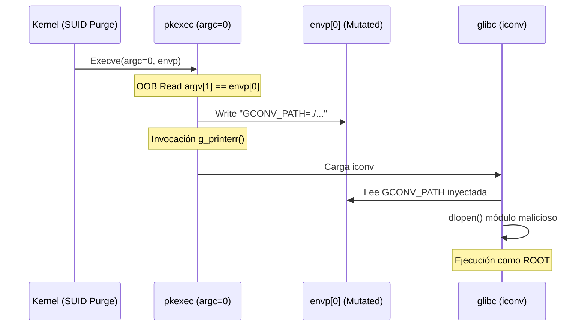

# CVE-2021-4034: PwnKit - Análisis Formal de Escalada de Privilegios

> [!CAUTION]
> **Severidad Crítica**: Esta vulnerabilidad en `pkexec` (polkit) permite una elevación de privilegios inmediata a `root` mediante la explotación de una lectura y escritura fuera de límites (OOB) causada por la ausencia de argumentos en la invocación (`argc=0`).

---

## 1. Definición Formal del Estado Inicial ($S_0$)

Bajo la ABI de System V para x86_64, el kernel estructura la pila durante `execve()`. La precondición estándar asume $argc \ge 1$, pero la inyección de una matriz vacía para `argv` resulta en $argc = 0$.

### Topología de la Pila en $S_0$

Matemáticamente, la relación de las direcciones base en un entorno contiguo es:
$$Address(envp) = Address(argv) + (argc + 1) \times \omega$$

Donde $\omega$ es el tamaño de palabra (8 bytes). Cuando $argc = 0$, la distancia topológica colapsa:
$$Address(envp) = Address(argv) + \omega$$

---

## 2. Mecánica Algebraica del Out-of-Bounds

El fallo reside en la suposición estática del estado $S_0$ en `pkexec.c` sin validación de límites. La dereferenciación matricial `argv[1]` se evalúa como:

$$Address(argv[1]) \equiv Address(argv[0]) + \omega \equiv Address(envp[0])$$

Esto permite a `pkexec` leer determinísticamente desde el vector de entorno y, posteriormente, escribir sobre él.

---

## 3. Transición de Lógica de Memoria y Explotación

La transición $S_0 \rightarrow S_1$ ocurre mediante la manipulación del vector procesado por `g_find_program_in_path()`.

### Secuencia de Corrupción

1. **Lectura (Read)**: `pkexec` lee `argv[1]`, que apunta a `envp[0]`.
2. **Resolución (Resolution)**: La función busca un ejecutable basado en la variable `PATH` (suministrada en $envp[1]$).
3. **Escritura (Write)**: El resultado de la resolución ("ruta/payload") se escribe sobre `argv[1]`, mutando efectivamente `envp[0]`.

---

## 4. Inyección de GCONV_PATH y Carga de Bibliotecas

La vulnerabilidad permite reintroducir la variable enviromental `GCONV_PATH` *después* de la purga inicial del linker SUID.

---

## 5. Conclusión de Verificación Formal

El fallo evidencia una violación en el paradigma de **Diseño por Contrato (Design by Contract)**. La asunción silogística de que el kernel garantiza $argc \ge 1$ resultó ser una convención cooperativa, no un axioma absoluto de la ABI.

**Corolario de Integridad**:
Cualquier modelo de máquina de estados que no garantice de forma exhaustiva las precondiciones estáticas de su espacio de entrada es demostrablemente inseguro frente a transiciones de estado anómalas.

---

## Referencias

* CVE-2021-4034 (NVD/MITRE)
* [Qualys Security Advisory: PwnKit](https://www.qualys.com/2022/01/25/cve-2021-4034/pwnkit.txt)
* CWE-125: Out-of-bounds Read / CWE-787: Out-of-bounds Write
